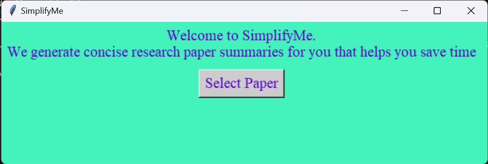

# SimplifyMe

The project aims to build a NLP based text summarization tool. With rise of machine learning models like transformers it has become easier than before to process and generate new text. We aim to use BART transformer model which is developed by facebook.

### Instruction to Execute Program
Run the following commands to execute the program successfully
```
To install python requirements
pip install -r requirement.txt

To Generate Summary
python app.pyw
```

### Model
To download the trained model visit the [Google Drive](https://drive.google.com/drive/u/1/folders/1bzGVJPfY-8LS4PlXlYFAjlhXEJB6H9i1)

### Interface



### Generated Summary

Here is a snapshot of Summary Generated by our Model on [paper](./ResearchPapers/text_summarization_techniques.pdf)

