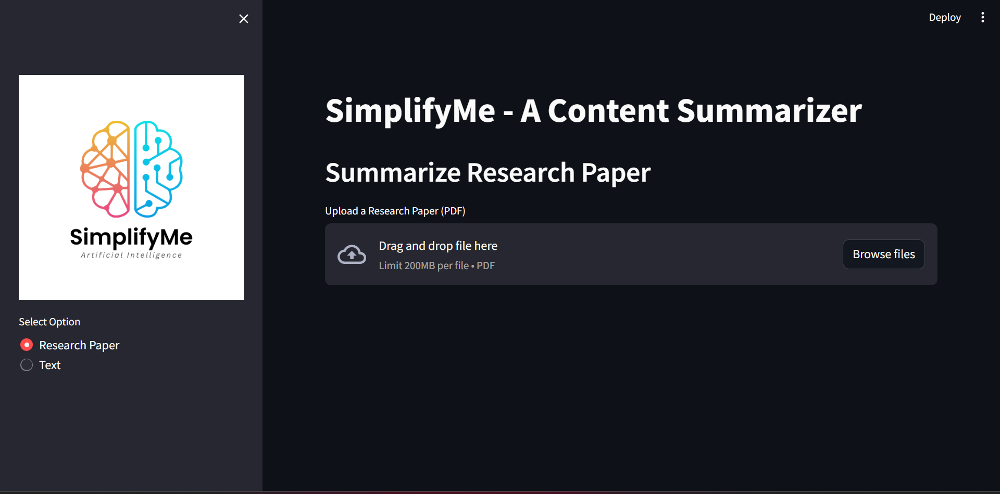

# SimplifyMe

The project aims to build a NLP based text summarization tool. With rise of machine learning models like transformers it has become easier than before to process and generate new text. We aim to use BART transformer model which is developed by facebook.

### Instruction to Execute Program
Run the following commands to execute the program successfully
```
To install python requirements
pip install -r requirement.txt

To run application on your browser
streamlit run src/app.py
```

### Model
To download the trained model visit the [Google Drive](https://drive.google.com/drive/u/1/folders/1bzGVJPfY-8LS4PlXlYFAjlhXEJB6H9i1)

### Interface



### Generated Summary

Here is a example of Summary Generated by our Model on a [paper](./ResearchPapers/text_summarization_techniques.pdf)

The aim of this paper is to present various methods for summarizing huge text documents. The first method is machine learning(ML), and the second method is extractive(ABS). In this paper , we present a new method cortex t summarization, which is based on extraction of the input data from the output data, and it is then applied to extractive (RST) summaries of text documents that have been used so far in various fields such as science, medicine, and bioinformatics. With the use of RST, we investigate the performance of in this paper, we discuss the various methods used in text summarization for past five years. The most common methods were found to be machine learning(ML), reinforcement learning, sequence to sequence modeling and fuzzy logic. Also, various optimization methods have been used to optimize the proposed objective function for the purpose of text summarizing. In this paper , we can see that various methods tested on the same dataset, and their accuracy scores were found different. After finding these methods, sentences in the document are then clustered together to discover the most informative sentences, and they were selected on the basis of sentence scores the purpose of this paper is to present a new method for online text summarization. The proposed method is based on deep learning techniques such as reinforced learning, reinforcement learning, convolutional IN(CNN), and reinforcement learning. In this paper , we propose a novel method to generate text summaries using deep learning methods such as naive bays, random forest (rogue), stochastic random walk (snow), random Forest (RFD), etc.), which can improve the quality of statistical analysis by reducing the number of words in the summary. The purpose of this study was to investigate the accuracy and accuracy of deep learning methods for text summarization using deep learning techniques. We used data from the university of Mankato and the department of computer science and engineering, e.g., r.j. Jain et al. (2009) and r.i.s.a.Jain and j. j. a. Jenkins (2015). In this paper , we propose a method to generate sequence - to - sequence text summaries based on convolutional IN(CNN) and reinforcement learning methods